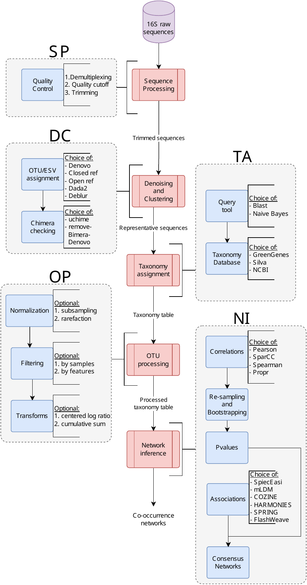

# MiCoNE - Microbial Co-occurrence Network Explorer


[](https://micone.readthedocs.io/en/latest/?badge=latest)
[](https://codecov.io/gh/segrelab/MiCoNE)
[](https://www.codefactor.io/repository/github/segrelab/micone)
[](https://pyup.io/repos/github/segrelab/MiCoNE/)
[](https://github.com/ambv/black)

`MiCoNE` is a Python package for the exploration of the effects of various possible tools used during the 16S data processing workflow on the inferred co-occurrence networks.
It is also developed as a flexible and modular pipeline for 16S data analysis, offering parallelized, fast and reproducible runs executed for different combinations of tools for each step of the data processing workflow.
It incorporates various popular, publicly available tools as well as custom Python modules and scripts to facilitate inference of co-occurrence networks from 16S data.

- Free software: MIT license
- Documentation: <https://micone.readthedocs.io/>

The MiCoNE framework is introduced in:

Kishore, D., Birzu, G., Hu, Z., DeLisi, C., Korolev, K., &amp; Segrè, D. (2023). Inferring microbial co-occurrence networks from amplicon data: A systematic evaluation. mSystems. doi:10.1128/msystems.00961-22.

Data related to the publication can be found on Zenodo: https://doi.org/10.5281/zenodo.7051556.

## Features

- Plug and play architecture: allows easy additions and removal of new tools
- Flexible and portable: allows running the pipeline on local machine, compute cluster or the cloud with minimal configuration change through the usage of [nextflow](www.nextflow.io)
- Parallelization: automatic parallelization both within and across samples (needs to be enabled in the `nextflow.config` file)
- Ease of use: available as a minimal `Python` library (without the pipeline) or as a full `conda` package

## Installation

Installing the `conda` package:

```sh
mamba env create -n micone -f https://raw.githubusercontent.com/segrelab/MiCoNE/master/env.yml
```

> NOTE:
> 1. MiCoNE requires the `mamba` package manager, otherwise `micone init` will not work.
> 2. Direct installation via anaconda cloud will be available soon.

Installing the minimal `Python` library:

```sh
pip install micone
```

> NOTE:
> The `Python` library does not provide the functionality to execute pipelines

## Workflow



It supports the conversion of raw 16S sequence data into co-occurrence networks.
Each process in the pipeline supports alternate tools for performing the same task, users can use the configuration file to change these values.

## Usage

The `MiCoNE` pipelines comes with an easy-to-use CLI. To get a list of subcommands you can type:

```sh
micone --help
```

Supported subcommands:

1. `install` - Initializes the package and environments (creates `conda` environments for various pipeline processes)
2. `init` - Initialize the nextflow templates for the micone workflow
3. `clean` - Cleans files from a pipeline run (cleans temporary data, log files and other extraneous files)
4. `validate-results` - Check the results of the pipeline execution

### Installing the environments

In order to run the pipeline various `conda` environments must first be installed on the system.
Use the following comand to initialize all the environments:
```sh
micone install
```

Or to initialize a particular environment use:
```sh
micone install -e "micone-qiime2"
```

The list of supported environments are:
- micone-cozine
- micone-dada2
- micone-flashweave
- micone-harmonies
- micone-mldm
- micone-propr
- micone-qiime2
- micone-sparcc
- micone-spieceasi
- micone-spring

### Initializing the pipeline template

To initialize the full pipeline (from raw 16S sequencing reads to co-occurrence networks):
```sh
micone init -w <workflow> -o <path/to/folder>
```

Other supported pipeline templates are (work in progress):
- full
- ni
- op_ni
- ta_op_ni

To run the pipeline, update the relevant config files (see next section), activate the `micone` environment and run the `run.sh` script that was copied to the directory:
```sh
bash run.sh
```
This runs the pipeline locally using the config options specified.

To run the pipeline on an SGE enabled cluster, add the relevant project/resource allocation flags to the `run.sh` script and run as:
```sh
qsub run.sh
```

## Configuration and the pipeline template

The pipeline template for the micone "workflow" (see previous section for list of supported options) is copied to the desired folder after running `micone init -w <workflow>`.
The template folder contains the following folders and files:

- nf_micone: Folder contatining the `micone` default configs, data, functions, and modules
- templates: Folder containing the templates (scripts) that are executed during the pipeline run
- main.nf: The pipeline "workflow" defined in the `nextflow` DSL 2 specification
- nextflow.config: The configuration for the pipeline. This file needs to be modified in order to change any configuration options for the pipeline run
- metadata.json: Contains the basic metadata that describes the dataset that is to be processed. Should be updated accordingly before pipeline execution
- samplesheet.csv: The file that contains the locations of the input data necessary for the pipeline run. Should be updated accordingly before pipeline execution
- run.sh: The `bash` script that contains commands used to execute the `nextflow` pipeline

The folder `nf_micone/configs` contains the default configs for all the `micone` pipeline workflows.
These options can also be viewed in tabular format in the [documentation](https://micone.readthedocs.io/en/latest/usage.html#configuring-the-pipeline).

For example, to change the tool used for OTU assignment to `dada2` and `deblur`, you can add the following to `nextflow.config`:
```groovy
// ... config initialization
params {
       // ... other config options
       denoise_cluster {
        otu_assignment {
            selection = ['dada2', 'deblur']
        }
    }
}
```

Example configuration files used for the analyses in the manuscript can be found [here](https://github.com/segrelab/MiCoNE-pipeline-paper/tree/master/scripts/runs).

## Visualization of results (coming soon)

The results of the pipeline execution can be visualized using the scripts in the [manuscript repo](https://github.com/segrelab/MiCoNE-pipeline-paper/tree/master/scripts)

## Know issues

1. If you have a version of `julia` that is preinstalled, make sure that it does not conflict with the version downloaded by the `micone-flashweave` environment
2. The data directory (`nf_micone/data`) needs to be manually downloaded using this [link](https://zenodo.org/record/7051556/files/data.zip?download=1).

## Credits

This package was created with [Cookiecutter](https://github.com/audreyr/cookiecutter) and the [audreyr/cookiecutter-pypackage](https://github.com/audreyr/cookiecutter-pypackage) project template.
